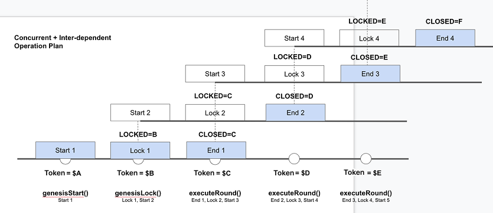
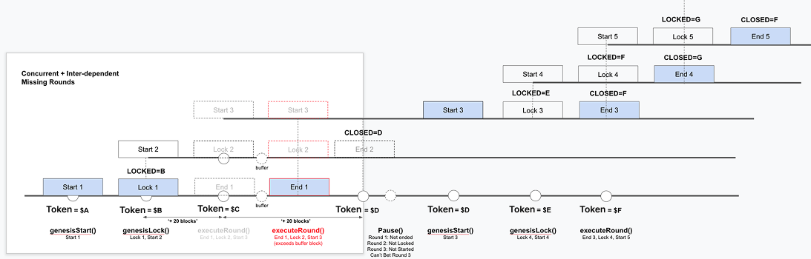

# HyperPredict V1 Contract

## Description

HyperPredict V1 Contract is a decentralized prediction market protocol built on HyperEVM. It allows users to bet on the price movement of HYPE/USD within specified time intervals (rounds). Each round consists of three phases: betting, locking, and execution. This contract was forked from PancakeSwap Prediction V1 Contract.

## Features

### Deployment

```bash
source config/env/hyperEvmTestnet/.env.HYPE-3min
# set Big Block Flag on HyperEVM Testnet:
npx @layerzerolabs/hyperliquid-composer set-block --size big --network testnet --private-key $ADMIN_PRIVATE_KEY

npx hardhat run --network hyperevm_testnet scripts/deploy-referral-registry.ts
npx hardhat run --network hyperevm_testnet scripts/deploy-factory.ts

source config/env/hyperEvmTestnet/.env.BTC-1d
npx hardhat run --network hyperevm_testnet scripts/deploy-pair.ts
source config/env/hyperEvmTestnet/.env.BTC-1h
npx hardhat run --network hyperevm_testnet scripts/deploy-pair.ts
source config/env/hyperEvmTestnet/.env.BTC-3min
npx hardhat run --network hyperevm_testnet scripts/deploy-pair.ts
source config/env/hyperEvmTestnet/.env.BTC-15min
npx hardhat run --network hyperevm_testnet scripts/deploy-pair.ts
source config/env/hyperEvmTestnet/.env.ETH-1d
npx hardhat run --network hyperevm_testnet scripts/deploy-pair.ts
source config/env/hyperEvmTestnet/.env.ETH-1h
npx hardhat run --network hyperevm_testnet scripts/deploy-pair.ts
source config/env/hyperEvmTestnet/.env.ETH-3min
npx hardhat run --network hyperevm_testnet scripts/deploy-pair.ts
source config/env/hyperEvmTestnet/.env.ETH-15min
npx hardhat run --network hyperevm_testnet scripts/deploy-pair.ts
source config/env/hyperEvmTestnet/.env.HYPE-1d
npx hardhat run --network hyperevm_testnet scripts/deploy-pair.ts
source config/env/hyperEvmTestnet/.env.HYPE-1h
npx hardhat run --network hyperevm_testnet scripts/deploy-pair.ts
source config/env/hyperEvmTestnet/.env.HYPE-3min
npx hardhat run --network hyperevm_testnet scripts/deploy-pair.ts
source config/env/hyperEvmTestnet/.env.HYPE-15min
npx hardhat run --network hyperevm_testnet scripts/deploy-pair.ts


# set Small Block Flag on HyperEVM Testnet for admin:
npx @layerzerolabs/hyperliquid-composer set-block --size small --network testnet --private-key $ADMIN_PRIVATE_KEY

export OPERATOR_PRIVATE_KEY=""

# set Small Block Flag on HyperEVM Testnet for operator:
npx @layerzerolabs/hyperliquid-composer set-block --size small --network testnet --private-key $OPERATOR_PRIVATE_KEY

# genesis round
npx hardhat run scripts/runRound/index.ts --network hyperevm_testnet

# set referral testers
npx hardhat run scripts/runRound/setReferral.ts --network hyperevm_testnet

# start test bot
npx hardhat run scripts/bot/testBet.ts --network hyperevm_testnet
```

### Operation

When a round is started, the round's `lockBlock` and `closeBlock` would be set.

`lockBlock` = current block + `intervalBlocks`

`closeBlock` = current block + (`intervalBlocks` \* 2)

## Kick-start Rounds

The rounds are always kick-started with:

```
genesisStartRound()
(wait for x blocks)
genesisLockRound()
(wait for x blocks)
executeRound()
```

## Continue Running Rounds

```
executeRound()
(wait for x blocks)
executeRound()
(wait for x blocks)
```

## Resuming Rounds

After errors like missing `executeRound()` etc.

```
pause()
(Users can't bet, but still is able to withdraw)
unpause()
startGenesisRound()
(wait for x blocks)
lockGenesisRound()
(wait for x blocks)
executeRound()
```

## Oracle Price

Pyth Network is used as the oracle price source.
https://www.npmjs.com/package/@pythnetwork/pyth-sdk-solidity

## Common Errors

Refer to `test/prediction.test.js`

## Architecture Illustration

### Normal Operation



### Missing Round Operation


